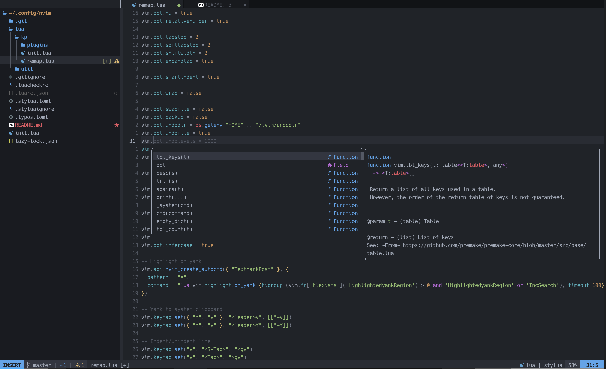

# My init.lua

My personal neovim config.

## Requirements

- [Neovim >=0.11.0 + config](https://github.com/neovim/neovim/tree/release-0.11)
	- `curl https://raw.githubusercontent.com/KaustubhPatange/init.lua/master/scripts/install_nvim.sh | sh`
- [Node >=18](https://nodejs.org/en/)
	- `curl https://raw.githubusercontent.com/KaustubhPatange/init.lua/master/scripts/install_node.sh | sh`
- [Python](https://www.python.org/)
- [lazygit](https://github.com/jesseduffield/lazygit) - git ui toggle `<leader>gg`
- [ripgrep](https://github.com/BurntSushi/ripgrep) - telescope

